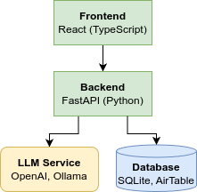

# System overview

The system consists of a React frontend (TypeScript) and a FastAPI backend (Python).

The figure below outlines current architecture.

The **frontend** is created as a React App, which allows for reusable components and state management. It is written with TypeScript to help guide developers with static type checking for interfaces and components.

The **backend** is written in Python using the library FastAPI which is tightly integrated with Pydantic’s model validation as well as asynchronous functions which work well with offloading work to LLM services.

The backend communicates with a **database**. At the time of writing, the database is a local SQLite database. It could also be an AirTable database which allows for remote editing of contents which will be reflected on the webpage. On the other hand, so little data is stored in the database that it can be considered overkill to use a database at all. It was initially implemented do allow for dynamic updating of some content on the webpage.

The backend offloads actual generation of responses to an **LLM service**. At the time of writing, it is an OpenAI API, but the architecture allows for relatively easy switch to other services. In local development, it is possible to use a local Ollama server.